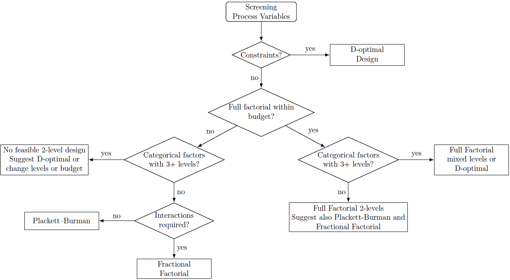
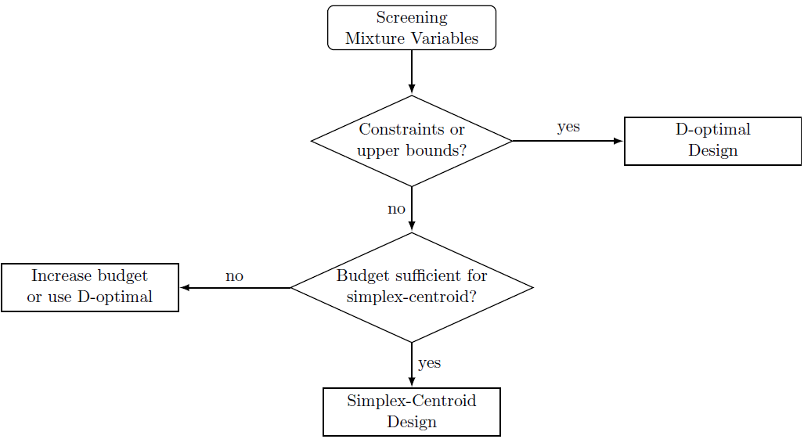
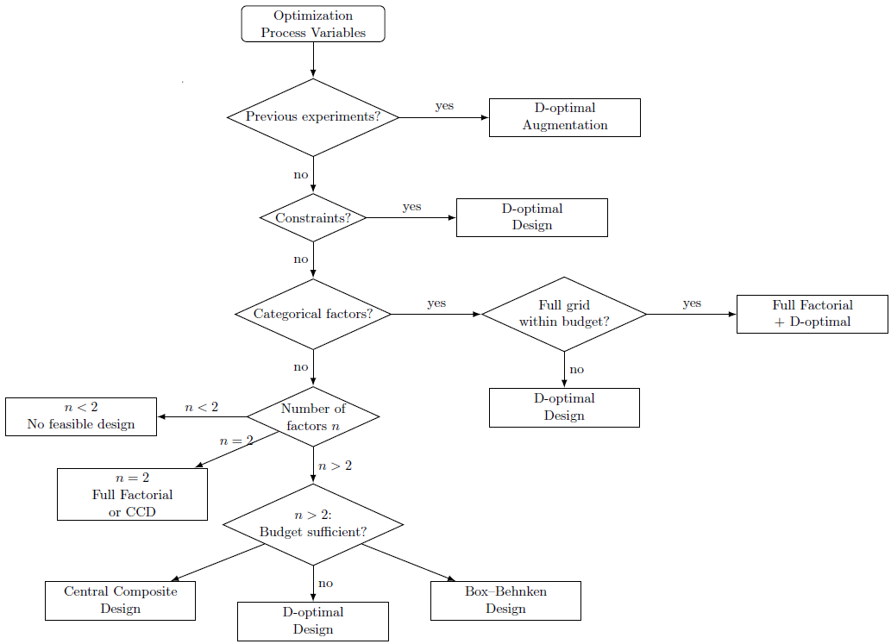
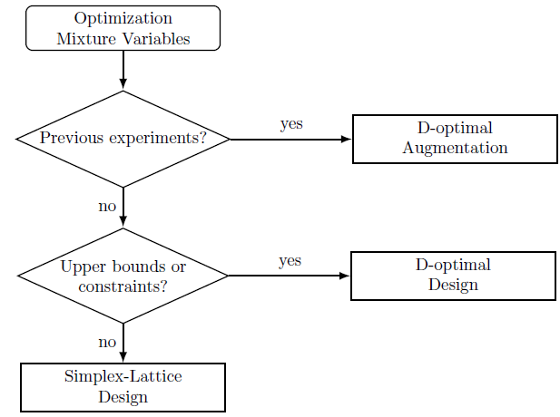

.. _design_advisor:

Design Advisor
==============

The **Design Advisor** is a useful tool that recommends appropriate experimental designs based on your factor types, experimental phase, budget constraints, and modeling goals. It analyzes your problem structure and suggests an appropriate design family for your specific scenario.

.. note::
    The Design Advisor is a recommendation tool and should be used as a guide. Always review the suggested designs and consider your specific experimental context when making a final decision.
    It is possible to start a design without using the advisor.

Main Function
-------------

.. autofunction:: doetools.suggest_design

Parameters Guide
----------------

phase
^^^^^
Choose the experimental phase:

* ``"screening"``: For identifying important factors among many candidates (typically uses 2-level designs)
* ``"optimization"``: For finding optimal conditions and modeling response surfaces (uses 3+ level designs)

model_order
^^^^^^^^^^^
Specify the expected model complexity:

* ``"linear"``: Main effects only (no interactions or curvature)
* ``"2FI"``: Two-factor interactions (main effects + pairwise interactions)
* ``"quadratic"``: Full quadratic model (main effects + interactions + quadratic terms)

Setting ``model_order`` helps the advisor recommend designs with sufficient degrees of freedom and appropriate structure for your modeling goals.

max_experiments
^^^^^^^^^^^^^^^
The maximum number of experimental runs you can perform. The advisor will:

* Recommend designs that fit within this budget
* Suggest alternatives if no suitable design exists
* Indicate when the budget is insufficient and provide guidance

non_rectangular_constraints
^^^^^^^^^^^^^^^^^^^^^^^^^^^^
Set to ``True`` if your feasible region has:

* Coupled constraints (e.g., var1 / var2 < some limit)
* Forbidden combinations of factor levels

When ``True``, the advisor typically recommends D-Optimal designs that can work within complex constraint regions.

performed_exp
^^^^^^^^^^^^^
Set to ``True`` if you have already performed some experiments and want to:

* Augment existing data with new runs
* Improve model precision sequentially

The advisor will recommend D-Optimal augmentation strategies instead of starting fresh designs.

Decision Logic
--------------

The Design Advisor follows a structured decision tree to provide recommendations. The diagrams below show the complete decision logic.

Screening with Process Factors
^^^^^^^^^^^^^^^^^^^^^^^^^^^^^^^^^^

Screening with Mixture Factors
^^^^^^^^^^^^^^^^^^^^^^^^^^^^^^^^^

Optimization with Process Factors
^^^^^^^^^^^^^^^^^^^^^^^^^^^^^^^^^^

Optimization with Mixture Factors
^^^^^^^^^^^^^^^^^^^^^^^^^^^^^^^^^^

Usage Examples
--------------

.. note::
    The examples below are self-contained summaries of common use cases. See
    :doc:`examples/index` for complete design notebooks.

Example: Screening Process Factors
^^^^^^^^^^^^^^^^^^^^^^^^^^^^^^^^^^^^^

Screen 5 continuous factors with a limited budget:

.. code-block:: python

    from doetools import ContinuousFactor as ContF, suggest_design
    
    factors = {
        'Temperature': ContF(n_levels=2, lower_bound=20, upper_bound=80),
        'Pressure': ContF(n_levels=2, lower_bound=1, upper_bound=5),
        'pH': ContF(n_levels=2, lower_bound=3, upper_bound=9),
        'Catalyst': ContF(n_levels=2, lower_bound=0.1, upper_bound=1.0),
        'Time': ContF(n_levels=2, lower_bound=10, upper_bound=60)
    }
    
    recommendations = suggest_design(
        factors=factors,
        phase='screening',
        model_order='linear',
        max_experiments=12,
        non_rectangular_constraints=False,
        performed_exp=False
    )

**Output**: Recommends Plackett-Burman Design (8 runs) for efficient main-effects screening.

|

See Also
--------

* :doc:`designs/process/index` - Process design documentation
* :doc:`designs/mixture/index` - Mixture design documentation
* :doc:`designs/optimal/index` - D-Optimal design documentation

